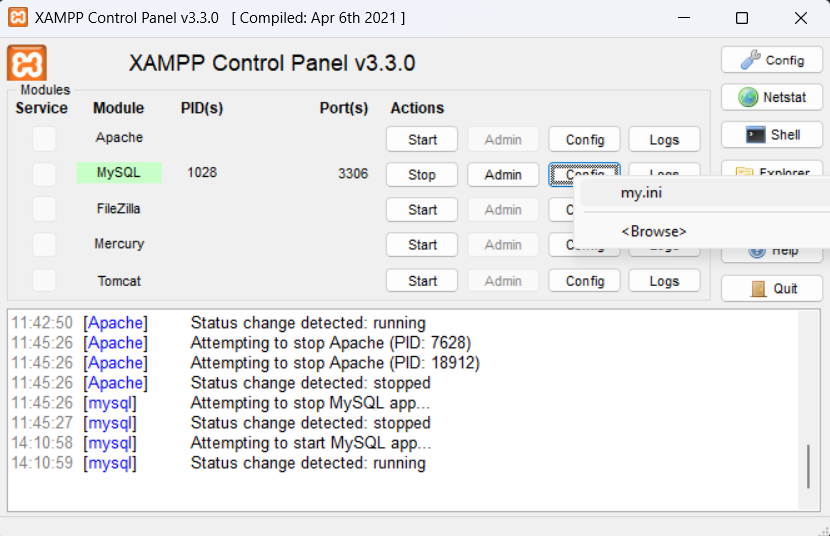

## 🧰 Avvio del Progetto – TripTales Backend (Django + MySQL via XAMPP)

Questa guida ti spiega passo per passo come avviare il backend del progetto **TripTales** in locale usando **Django 4.2** e **MySQL fornito da XAMPP**.

---

### ✅ **Requisiti**

- Python 3.9+
- XAMPP installato (con MariaDB)
- Git
- pip (gestore pacchetti Python)

---

### ⚙️ **1. Avvia XAMPP**

1. Apri il **pannello di controllo di XAMPP**
2. Avvia **solo il modulo MySQL**
3. (Puoi ignorare Apache)

---

### 🗂️ **2. Clona il repository**

```bash
git clone https://github.com/FantinJacopo/pw-backend-triptales.git
cd pw-backend-triptales
```

---

### 📦 **3. Installa le dipendenze**

Si consiglia l'uso di un virtual environment (facoltativo):

```bash
python -m venv venv
source venv/bin/activate   # Su Windows: venv\Scripts\activate
pip install -r requirements.txt
```

---

### 🔐 **4. Crea un file `.env` nella root**

Contenuto di esempio:

```env
DB_NAME=pwtriptales_db
DB_USER=root
DB_PASSWORD=
DB_HOST=INDIRIZZO_IP_DEL_DISPOSITIVO
DB_PORT=3306
```

> ⚠️ `DB_PASSWORD` lascia vuoto se in XAMPP non hai impostato una password (default)

---

### 🧱 **5. Crea il database in XAMPP**

Accedi a phpMyAdmin:  
http://localhost/phpmyadmin

Esegui la seguente query SQL:

```sql
CREATE DATABASE pwtriptales_db CHARACTER SET utf8mb4 COLLATE utf8mb4_unicode_ci;
```

### 🔑 **5.1. Modifica le impostazioni di XAMPP**

1. Apri il **pannello di controllo di XAMPP**
2. Apri il file di configurazione my.ini di MySQL
3. cerca la riga `bind-address` e sostituisci `127.0.0.1` con l'indirizzo ip del dispositivo su cui desideri eseguire il backend
---

### 🔄 **6. Applica le migrazioni**

```bash
python manage.py makemigrations
python manage.py migrate
```

---

### 👑 **7. (Opzionale) Crea un superuser per accedere all’admin**

```bash
python manage.py createsuperuser
```

---

### 🚀 **8. Avvia il server di sviluppo**

```bash
python manage.py runserver INDIRIZZO_IP_DEL_DISPOSITIVO
```

Visita [http://INDIRIZZO_IP_DEL_DISPOSITIVO:8000](http://INDIRIZZO_IP_DEL_DISPOSITIVO:8000)  
L’admin sarà su [http://INDIRIZZO_IP_DEL_DISPOSITIVO:8000/admin](http://INDIRIZZO_IP_DEL_DISPOSITIVO:8000/admin)

---

### ✅ Fine! Ora sei pronto per sviluppare.
